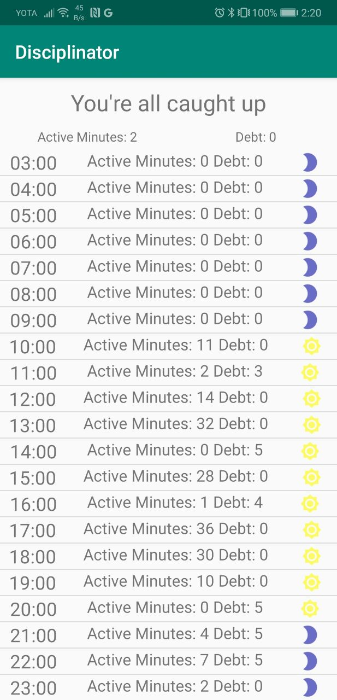

### Disciplinator for Android

#### Note: this project is discontinued and replaced with the [flutter Android/iOS app](https://github.com/mersinvald/disciplinator-app).

This is an app for displaying information provided by the [Disciplinator](https://github.com/mersinvald/disciplinator) project:

 - The current state
 - Active minutes and debt for the current hour
 - Day log hour-by-hour

Also it realizes support for [OneSignal](https://onesignal.com/) push notifications service, so it's possible to
send notifications through a respective [Executor](https://github.com/mersinvald/disciplinator/tree/master/driver/drivers/executor) plugin that works with OneSignal's REST API.

### Screenshot

